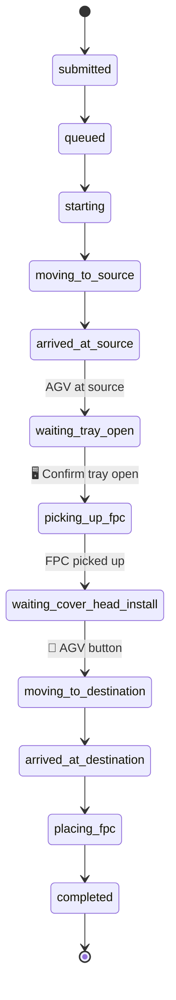
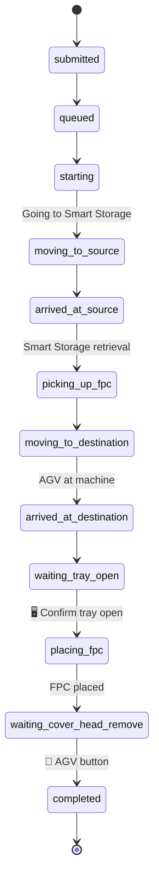

# NXP WT FPC Management System — REST API Specification v1.0

> **Audience**: Backend development team  
> **Frontend repository**: `Operator_UI` (React 18 + TypeScript + Vite)  
> **Last updated**: 2025-07-16

---

## Table of Contents

1. [Overview & Conventions](#1-overview--conventions)
2. [Entity / Data Models](#2-entity--data-models)
3. [Health Check](#3-health-check)
4. [Machines](#4-machines)
5. [FPCs (Front Opening Pod Carriers)](#5-fpcs-front-opening-pod-carriers)
6. [Tasks — Submission & Lifecycle](#6-tasks--submission--lifecycle)
7. [Tasks — Operator Confirmations (Frontend → Backend)](#7-tasks--operator-confirmations-frontend--backend)
8. [Tasks — AGV Hardware Confirmations (AGV → Backend)](#8-tasks--agv-hardware-confirmations-agv--backend)
9. [AGV Management](#9-agv-management)
10. [Audit Logs](#10-audit-logs)
11. [\[Phase 2\] Authentication & Session Management](#11-phase-2-authentication--session-management)
12. [\[Phase 2\] User Management (RBAC)](#12-phase-2-user-management-rbac)
13. [Task State Machines (Per Mode)](#13-task-state-machines-per-mode)
14. [Error Codes Reference](#14-error-codes-reference)
15. [Enums & Constants Reference](#15-enums--constants-reference)
16. [Thai Operator Glossary](#16-thai-operator-glossary)

---

## 1. Overview & Conventions

### Base URL

```
/api/v1/
```

URL path versioning. Only bump to `/api/v2/` for breaking changes (field removal, type changes, URL restructuring). Non-breaking additions (new fields, new endpoints) stay in `v1`.

### Transport & Content Type

| Aspect | Value |
|--------|-------|
| Protocol | HTTPS in production; HTTP acceptable for local/on-prem development |
| Content-Type | `application/json` (all request and response bodies) |
| Character Encoding | UTF-8 |

### Timestamps

All timestamps **MUST** be ISO 8601 in UTC with the `Z` suffix:

```
2025-07-15T10:30:00Z
```

Clients render timestamps in the operator's local timezone (Asia/Bangkok, UTC+7).

### Response Envelope

#### Single Resource

```json
{
  "data": {
    "taskId": "TASK-1720000000000",
    "status": "submitted",
    "createdAt": "2025-07-15T10:30:00Z"
  }
}
```

#### Collection (Paginated)

```json
{
  "data": [ ... ],
  "meta": {
    "total": 142,
    "page": 1,
    "perPage": 20,
    "totalPages": 8
  }
}
```

#### Error

```json
{
  "error": {
    "code": "validation_error",
    "message": "Request validation failed",
    "details": [
      {
        "field": "sourceMachineId",
        "message": "Source machine does not have a Probecard",
        "code": "fpc_not_found_on_machine"
      }
    ]
  }
}
```

### Pagination, Filtering & Sorting

All list endpoints support these query parameters:

| Parameter | Type | Default | Description |
|-----------|------|---------|-------------|
| `page` | integer | `1` | Page number (1-indexed) |
| `perPage` | integer | `20` | Items per page (max: 100) |
| `sort` | string | `-createdAt` | Field to sort by; prefix `-` for descending |

Filtering is endpoint-specific (documented per endpoint). Multiple values use comma separation: `?status=queued,starting`.

### Authentication — Phase 1 (Current)

> **⚠️ In the current phase, there is NO authentication or access control.** Employee ID is used for **transaction logging only**. All operator flows work without login.

Every mutating endpoint accepts an `employeeId` field in the request body. This value is recorded in audit logs for traceability but is **not** verified against any user database.

```json
{
  "employeeId": "operator_001",
  "sourceMachineId": "AVT_005"
}
```

### Authentication — Phase 2 (Future)

See [Section 11](#11-phase-2-authentication--session-management) for the planned HttpOnly + Secure session cookie mechanism.

### Polling Strategy

The frontend polls for task status updates using REST. **No WebSocket is required.**

| Scenario | Endpoint | Interval | Stop Condition |
|----------|----------|----------|----------------|
| Active task detail | `GET /api/v1/tasks/{id}` | 2–3 seconds | Task reaches terminal state |
| Task queue list | `GET /api/v1/tasks` | 5 seconds | — |
| Machine list | `GET /api/v1/machines` | 10 seconds | — |
| AGV status badges | `GET /api/v1/agvs` | 10 seconds | — |

**Terminal states** (stop polling): `completed`, `rejected`, `blocked`, `failed`, `canceled`, `error`.

> **Future note (optional)**: Server-Sent Events (SSE) via `GET /api/v1/tasks/{id}/events` may be added as an alternative to polling. This is not required for Phase 1.

### Idempotency

Task submission endpoints (`POST /api/v1/tasks`) accept an optional `Idempotency-Key` request header:

```
Idempotency-Key: 550e8400-e29b-41d4-a716-446655440000
```

| Rule | Description |
|------|-------------|
| Format | UUID v4 |
| Window | Backend caches the response for 24 hours |
| Duplicate | Returns the original `201 Created` response (not a new task) |
| Conflict | If a different request body is sent with the same key → `409 Conflict` |

This prevents duplicate task creation from double-taps on operator tablets or network retries.

### Queue Semantics

- **Smart Storage** has a **single exit/entry port**. Only one AGV can interact with the port at a time.
- The system supports **≥ 3 AGVs**. Tasks are assigned to an available AGV by the backend scheduler.
- When no AGV is available or the Smart Storage port is occupied, tasks remain in `queued` status.
- The `queuePosition` field in the task response indicates the task's position in the queue (1-indexed, `null` when not queued).

### Field Naming Convention

All JSON field names use **camelCase** to align with the TypeScript frontend. Examples: `taskId`, `employeeId`, `createdAt`, `sourceMachine`.

### Status Codes — Language Independence

All status values (task status, machine status, AGV status) are **language-independent enum strings** (e.g., `waiting_cover_head_install`). The **frontend** is responsible for mapping these to Thai operator-facing text. The backend MUST NOT send localized strings.

---

## 2. Entity / Data Models

### Task

| Field | Type | Nullable | Description |
|-------|------|----------|-------------|
| `taskId` | string | No | Auto-generated unique ID (e.g., `"TASK-1720000000000"`) |
| `jobId` | string | No | Human-readable job ID, format: `JOB_YYMMDD_NNN` (e.g., `"JOB_250715_001"`), counter resets daily |
| `type` | enum | No | Operation mode: `return`, `request`, `move`, `unload_load` |
| `status` | enum | No | Current task status (see [Task Status Enum](#task-status)) |
| `employeeId` | string | No | ID of the operator who submitted the task |
| `sourceMachine` | string | Yes | Source machine name (null for `request` type where source is Smart Storage) |
| `destinationMachine` | string | Yes | Destination machine name (null for `return` type where destination is Smart Storage) |
| `fpcId` | string | Yes | FPC ID being transported (null for `return` and basic `move`) |
| `agvId` | string | Yes | Assigned AGV ID (null until AGV is assigned after `queued`) |
| `message` | string | No | Human-readable status message (English) |
| `createdAt` | string | No | ISO 8601 UTC timestamp |
| `isOccupiedMove` | boolean | No | `true` if destination had an FPC when move was submitted |
| `oldFpcId` | string | Yes | ID of the FPC that was on the destination (occupied move / unload & load only) |
| `trayOpenedConfirmed` | boolean | No | Whether operator confirmed tray is open (screen button) |
| `coverHeadPhysicalConfirmed` | boolean | No | Whether AGV physical button was pressed |
| `currentStepIndex` | integer | Yes | Current position in the step sequence |
| `queuePosition` | integer | Yes | Position in queue (1-indexed); `null` when not in `queued` status |

### FPC (Front Opening Pod Carrier)

| Field | Type | Nullable | Description |
|-------|------|----------|-------------|
| `id` | string | No | Unique FPC identifier (e.g., `"2ID021FV002B"`, `"P14380-FHB-0596"`) |
| `address` | string | No | Slot address in Smart Storage (e.g., `"002"`); `"-"` when on a machine |
| `functionName` | string | No | Process function (e.g., `"PM Load"`) |
| `label` | string | No | Display label |
| `comment` | string | Yes | Free-text operator comment |
| `category` | enum | No | Storage category: `Storage`, `Service`, `Deposit PM`, `Deposit Production` |
| `location` | string | No | Current location: `"Smart Storage"` or machine ID (e.g., `"AVT_002"`) |

### Machine

| Field | Type | Nullable | Description |
|-------|------|----------|-------------|
| `id` | string | No | Unique machine ID (e.g., `"AVT_001"`) |
| `name` | string | No | Display name (usually same as ID) |
| `status` | enum | No | Availability status: `available`, `engineering_use`, `breakdown`, `pm`, `other` |
| `statusComment` | string | Yes | Free-text reason for unavailability |
| `state` | enum | No | Computed operational state: `empty`, `occupied`, `reserved`, `unavailable` |
| `fpcId` | string | Yes | ID of the FPC currently on this machine (`null` if empty) |

> **`status` vs `state`**: `status` is the administrative availability set by admins (available / engineering_use / breakdown / pm / other). `state` is the computed real-time operational state (empty / occupied / reserved / unavailable) derived from `status`, active FPCs, and active tasks.

### AGV (Automated Guided Vehicle)

| Field | Type | Nullable | Description |
|-------|------|----------|-------------|
| `id` | string | No | Unique AGV ID (e.g., `"AGV-01"`) |
| `name` | string | No | Display name (e.g., `"AGV 1"`) |
| `number` | integer | No | AGV number (e.g., `1`) |
| `status` | enum | No | Operational status: `ok`, `engineering_use`, `pm`, `error` |

### AuditLog

| Field | Type | Nullable | Description |
|-------|------|----------|-------------|
| `id` | string | No | Unique log ID (e.g., `"LOG-1720000000000-042"`) |
| `timestamp` | string | No | ISO 8601 UTC |
| `eventType` | enum | No | `LOGIN`, `LOGOUT`, `TASK_SUBMIT`, `STATE_CHANGE`, `CONFIRMATION`, `CANCEL`, `SYSTEM` |
| `employeeId` | string | No | ID of the actor (or `"SYSTEM"` for automated events) |
| `message` | string | No | Human-readable description of the event |

### User (Phase 2)

| Field | Type | Nullable | Description |
|-------|------|----------|-------------|
| `employeeId` | string | No | Primary key; unique employee identifier |
| `role` | enum | No | `admin`, `store`, `operator` |
| `createdAt` | string | No | ISO 8601 UTC |
| `updatedAt` | string | No | ISO 8601 UTC |

> Password is **never** returned in API responses.

---

## 3. Health Check

### `GET /api/v1/health`

Returns the system health status. Used by monitoring tools and the frontend for connectivity checks.

**Response: `200 OK`**

```json
{
  "data": {
    "status": "healthy",
    "version": "1.0.0",
    "timestamp": "2025-07-15T10:30:00Z",
    "services": {
      "database": "connected",
      "agvController": "connected",
      "smartStorage": "connected"
    }
  }
}
```

**Response: `503 Service Unavailable`** (if any critical service is down)

```json
{
  "data": {
    "status": "degraded",
    "version": "1.0.0",
    "timestamp": "2025-07-15T10:30:00Z",
    "services": {
      "database": "connected",
      "agvController": "disconnected",
      "smartStorage": "connected"
    }
  }
}
```

---

## 4. Machines

### `GET /api/v1/machines`

List all machines with computed state.

**Query Parameters:**

| Parameter | Type | Description |
|-----------|------|-------------|
| `status` | string | Filter by status: `available`, `engineering_use`, `breakdown`, `pm`, `other` |
| `state` | string | Filter by computed state: `empty`, `occupied`, `reserved`, `unavailable` |
| `q` | string | Search by machine ID or name |

**Response: `200 OK`**

```json
{
  "data": [
    {
      "id": "AVT_001",
      "name": "AVT_001",
      "status": "available",
      "statusComment": null,
      "state": "occupied",
      "fpcId": "2ID021FV003B"
    },
    {
      "id": "AVT_003",
      "name": "AVT_003",
      "status": "pm",
      "statusComment": "Scheduled monthly PM",
      "state": "unavailable",
      "fpcId": null
    }
  ],
  "meta": {
    "total": 50,
    "page": 1,
    "perPage": 50,
    "totalPages": 1
  }
}
```

### `GET /api/v1/machines/{id}`

Get a single machine with computed state.

**Response: `200 OK`**

```json
{
  "data": {
    "id": "AVT_001",
    "name": "AVT_001",
    "status": "available",
    "statusComment": null,
    "state": "occupied",
    "fpcId": "2ID021FV003B"
  }
}
```

**Response: `404 Not Found`**

```json
{
  "error": {
    "code": "not_found",
    "message": "Machine not found"
  }
}
```

### `PATCH /api/v1/machines/{id}/availability`

Update machine availability status. In Phase 2, restricted to `admin` and `store` roles.

**Request Body:**

```json
{
  "employeeId": "admin_001",
  "status": "engineering_use",
  "statusComment": "Product test optimization"
}
```

| Field | Type | Required | Description |
|-------|------|----------|-------------|
| `employeeId` | string | Yes | For audit logging |
| `status` | enum | Yes | New status: `available`, `engineering_use`, `breakdown`, `pm`, `other` |
| `statusComment` | string | No | Free-text reason (recommended when status != `available`) |

**Response: `200 OK`**

```json
{
  "data": {
    "id": "AVT_010",
    "name": "AVT_010",
    "status": "engineering_use",
    "statusComment": "Product test optimization",
    "state": "unavailable",
    "fpcId": null
  }
}
```

**Response: `404 Not Found`** — Machine not found.

---

## 5. FPCs (Front Opening Pod Carriers)

### `GET /api/v1/fpcs`

List all FPCs. Supports filtering and search.

**Query Parameters:**

| Parameter | Type | Description |
|-----------|------|-------------|
| `category` | string | Filter by category: `Storage`, `Service`, `Deposit PM`, `Deposit Production` |
| `location` | string | Filter by location: `Smart Storage` or machine ID |
| `q` | string | Search across `address`, `functionName`, `label`, `comment` fields |
| `page` | integer | Page number (default: 1) |
| `perPage` | integer | Items per page (default: 20) |

**Response: `200 OK`**

```json
{
  "data": [
    {
      "id": "2ID021FV002B",
      "address": "002",
      "functionName": "PM Load",
      "label": "2ID021FV002B",
      "comment": "",
      "category": "Storage",
      "location": "Smart Storage"
    },
    {
      "id": "2IE075TV001B",
      "address": "-",
      "functionName": "PM Load",
      "label": "2IE075TV001B",
      "comment": null,
      "category": "Service",
      "location": "AVT_002"
    }
  ],
  "meta": {
    "total": 12,
    "page": 1,
    "perPage": 20,
    "totalPages": 1
  }
}
```

### `GET /api/v1/fpcs/{id}`

Get a single FPC by ID.

**Response: `200 OK`**

```json
{
  "data": {
    "id": "2ID021FV002B",
    "address": "002",
    "functionName": "PM Load",
    "label": "2ID021FV002B",
    "comment": "",
    "category": "Storage",
    "location": "Smart Storage"
  }
}
```

**Response: `404 Not Found`** — FPC not found.

### `PATCH /api/v1/fpcs/{id}/comment`

Update the operator comment on an FPC.

**Request Body:**

```json
{
  "employeeId": "store_001",
  "comment": "Needs recalibration before next use"
}
```

**Response: `200 OK`**

```json
{
  "data": {
    "id": "2ID021FV002B",
    "address": "002",
    "functionName": "PM Load",
    "label": "2ID021FV002B",
    "comment": "Needs recalibration before next use",
    "category": "Storage",
    "location": "Smart Storage"
  }
}
```

### `PATCH /api/v1/fpcs/{id}/location`

Manually correct an FPC's location (admin override for mismatch resolution).

**Request Body:**

```json
{
  "employeeId": "admin_001",
  "newLocation": "Smart Storage",
  "newAddress": "015"
}
```

| Field | Type | Required | Description |
|-------|------|----------|-------------|
| `employeeId` | string | Yes | For audit logging |
| `newLocation` | string | Yes | `"Smart Storage"` or machine ID (e.g., `"AVT_005"`) |
| `newAddress` | string | Conditional | Required when `newLocation` is `"Smart Storage"` (slot number) |

**Response: `200 OK`** — Updated FPC object.

**Error Responses:**

| Status | Code | Scenario |
|--------|------|----------|
| `404` | `fpc_not_found` | FPC ID does not exist |
| `409` | `slot_occupied` | Target Smart Storage slot already has an FPC |
| `409` | `machine_occupied` | Target machine already has an FPC |

### `POST /api/v1/fpcs/swap-locations`

Swap the locations of two FPCs (admin override).

**Request Body:**

```json
{
  "employeeId": "admin_001",
  "fpcId1": "2ID021FV002B",
  "fpcId2": "P14380-FHB-0596"
}
```

**Response: `200 OK`**

```json
{
  "data": {
    "fpc1": {
      "id": "2ID021FV002B",
      "location": "Smart Storage",
      "address": "003"
    },
    "fpc2": {
      "id": "P14380-FHB-0596",
      "location": "Smart Storage",
      "address": "002"
    }
  }
}
```

**Error Responses:**

| Status | Code | Scenario |
|--------|------|----------|
| `404` | `fpc_not_found` | One or both FPC IDs do not exist |

---

## 6. Tasks — Submission & Lifecycle

### `POST /api/v1/tasks`

Submit a new transport task. The `type` field determines required fields and the state machine used.

**Request Headers:**

| Header | Required | Description |
|--------|----------|-------------|
| `Idempotency-Key` | Recommended | UUID v4 to prevent duplicate submissions |

#### Variant A: LOAD (คืน FPC) — `type: "return"`

Pick up FPC from a machine, return it to Smart Storage.

```json
{
  "employeeId": "operator_001",
  "type": "return",
  "sourceMachineId": "AVT_005"
}
```

| Field | Type | Required | Description |
|-------|------|----------|-------------|
| `employeeId` | string | Yes | For audit logging |
| `type` | string | Yes | `"return"` |
| `sourceMachineId` | string | Yes | Machine ID to pick up FPC from |

**Validation:**
- Source machine must have an FPC installed
- Source machine must be `available`

---

#### Variant B: UNLOAD (เบิก FPC) — `type: "request"`

Retrieve a specific FPC from Smart Storage and deliver it to a machine.

```json
{
  "employeeId": "operator_001",
  "type": "request",
  "fpcId": "2ID021FV002B",
  "destinationMachineId": "AVT_005"
}
```

| Field | Type | Required | Description |
|-------|------|----------|-------------|
| `employeeId` | string | Yes | For audit logging |
| `type` | string | Yes | `"request"` |
| `fpcId` | string | Yes | ID of FPC to retrieve from Smart Storage |
| `destinationMachineId` | string | Yes | Machine ID to deliver FPC to |

**Validation:**
- FPC must exist in Smart Storage
- Destination machine must NOT already have an FPC
- Destination machine must be `available`

---

#### Variant C: MOVE (ย้าย FPC) — `type: "move"`

Transfer an FPC from one machine to another.

```json
{
  "employeeId": "operator_001",
  "type": "move",
  "sourceMachineId": "AVT_001",
  "destinationMachineId": "AVT_008"
}
```

| Field | Type | Required | Description |
|-------|------|----------|-------------|
| `employeeId` | string | Yes | For audit logging |
| `type` | string | Yes | `"move"` |
| `sourceMachineId` | string | Yes | Machine to pick up FPC from |
| `destinationMachineId` | string | Yes | Machine to deliver FPC to |

**Validation:**
- Source machine must have an FPC installed
- Source and destination must be different machines
- Both machines must be `available`

**Swap variant**: If the destination machine already has an FPC, the backend automatically switches to the **occupied move** workflow: retrieve new FPC → retrieve old FPC from destination → place new FPC → return old FPC to Smart Storage. The response includes `isOccupiedMove: true` and `oldFpcId`.

---

#### Variant D: UNLOAD & LOAD (เปลี่ยน FPC) — `type: "unload_load"`

Remove the old FPC from a machine and install a new FPC from Smart Storage.

```json
{
  "employeeId": "operator_001",
  "type": "unload_load",
  "fpcId": "2ID021FV002B",
  "destinationMachineId": "AVT_005"
}
```

| Field | Type | Required | Description |
|-------|------|----------|-------------|
| `employeeId` | string | Yes | For audit logging |
| `type` | string | Yes | `"unload_load"` |
| `fpcId` | string | Yes | New FPC to retrieve from Smart Storage |
| `destinationMachineId` | string | Yes | Machine to swap FPCs on |

**Validation:**
- New FPC must exist in Smart Storage
- Destination machine **MUST** already have an FPC installed (this is a swap operation)
- Destination machine must be `available`

---

#### Submission Response (all variants)

**Response: `201 Created`**

```json
{
  "data": {
    "taskId": "TASK-1720000000000",
    "jobId": "JOB_250715_001",
    "type": "return",
    "status": "submitted",
    "message": "Job submitted successfully",
    "employeeId": "operator_001",
    "sourceMachine": "AVT_005",
    "destinationMachine": "Smart Storage",
    "fpcId": null,
    "agvId": null,
    "createdAt": "2025-07-15T10:30:00Z",
    "isOccupiedMove": false,
    "oldFpcId": null,
    "trayOpenedConfirmed": false,
    "coverHeadPhysicalConfirmed": false,
    "currentStepIndex": 0,
    "queuePosition": null
  }
}
```

**Error Responses:**

| Status | Code | Scenario |
|--------|------|----------|
| `400` | `validation_error` | Missing required fields or invalid field values |
| `404` | `machine_not_found` | Machine ID does not exist |
| `404` | `fpc_not_found` | FPC ID does not exist |
| `409` | `fpc_not_on_machine` | Source machine does not have an FPC (for `return`, `move`) |
| `409` | `machine_already_occupied` | Destination machine already has an FPC (for `request`) |
| `409` | `machine_not_occupied` | Destination machine does not have an FPC (for `unload_load`) |
| `409` | `same_source_destination` | Source and destination are the same machine |
| `409` | `duplicate_submission` | Idempotency key conflict with different request body |
| `422` | `machine_unavailable` | Machine is not in `available` status |

---

### `GET /api/v1/tasks`

List all tasks, paginated and sorted.

**Query Parameters:**

| Parameter | Type | Description |
|-----------|------|-------------|
| `status` | string | Filter by status (comma-separated): `queued,starting,moving_to_source` |
| `type` | string | Filter by type: `return`, `request`, `move`, `unload_load` |
| `employeeId` | string | Filter by submitting employee |
| `active` | boolean | `true` = non-terminal only; `false` = terminal only |
| `createdAt[after]` | string | ISO 8601 lower bound |
| `createdAt[before]` | string | ISO 8601 upper bound |
| `sort` | string | Default: `-createdAt`. Other: `createdAt`, `status` |
| `page` | integer | Page number |
| `perPage` | integer | Items per page |

**Default Sort**: Active tasks first (sorted by `-createdAt`), then terminal tasks at bottom.

**Response: `200 OK`**

```json
{
  "data": [
    {
      "taskId": "TASK-1720000000000",
      "jobId": "JOB_250715_001",
      "type": "return",
      "status": "moving_to_source",
      "message": "AGV is moving to source machine",
      "employeeId": "operator_001",
      "sourceMachine": "AVT_005",
      "destinationMachine": "Smart Storage",
      "fpcId": null,
      "agvId": "AGV-01",
      "createdAt": "2025-07-15T10:30:00Z",
      "isOccupiedMove": false,
      "oldFpcId": null,
      "trayOpenedConfirmed": false,
      "coverHeadPhysicalConfirmed": false,
      "currentStepIndex": 3,
      "queuePosition": null
    }
  ],
  "meta": {
    "total": 5,
    "page": 1,
    "perPage": 20,
    "totalPages": 1
  }
}
```

### `GET /api/v1/tasks/{id}`

Get a single task by ID. **Primary polling endpoint** — frontend calls this every 2–3 seconds for active tasks.

**Response: `200 OK`** — Full task object (same shape as collection items).

**Response: `404 Not Found`** — Task not found.

### `POST /api/v1/tasks/{id}/cancel`

Cancel an active task.

**Request Body:**

```json
{
  "employeeId": "operator_001"
}
```

**Response: `200 OK`**

```json
{
  "data": {
    "taskId": "TASK-1720000000000",
    "status": "canceled",
    "message": "Job canceled by user"
  }
}
```

**Error Responses:**

| Status | Code | Scenario |
|--------|------|----------|
| `404` | `task_not_found` | Task ID does not exist |
| `409` | `task_already_terminal` | Task is already in a terminal state |

---

## 7. Tasks — Operator Confirmations (Frontend → Backend)

These endpoints are called by the **frontend UI** when the operator interacts with on-screen buttons.

### `POST /api/v1/tasks/{id}/confirm-tray-opened`

Operator confirms the machine tray is open via the **on-screen button**. This is a **screen-based** confirmation that the operator clicks on the tablet/monitor.

Called when task status is `waiting_tray_open`.

**Request Body:**

```json
{
  "employeeId": "operator_001",
  "confirmed": true
}
```

**Response: `200 OK`** — Updated task object. The task automatically advances to the next step in its state machine.

**Error Responses:**

| Status | Code | Scenario |
|--------|------|----------|
| `404` | `task_not_found` | Task ID does not exist |
| `409` | `invalid_task_state` | Task is not in `waiting_tray_open` status |

> **CRITICAL DESIGN NOTE**: This is the **only** confirmation endpoint the frontend calls. Cover head confirmations are triggered by the **physical button on the AGV**, not from the web UI.

---

## 8. Tasks — AGV Hardware Confirmations (AGV → Backend)

> **⚠️ These endpoints are NOT called by the frontend.** They are called by the AGV hardware controller when the physical button on the AGV is pressed. The frontend simply observes the status change via polling.

The frontend UI displays:
- An amber instruction card with animation
- A waiting/loader indicator
- Instructions to press the physical button on the AGV
- **No screen-based "Confirm" or "Complete" button**

### `POST /api/v1/tasks/{id}/confirm-cover-head-installed`

Signal from the AGV controller that the cover head has been physically installed and the AGV button was pressed.

Called when task status is `waiting_cover_head_install`.

**Request Body:**

```json
{
  "agvId": "AGV-01",
  "confirmedAt": "2025-07-15T10:35:00Z"
}
```

**Response: `200 OK`** — Task advances to `moving_to_destination` (or next appropriate step).

### `POST /api/v1/tasks/{id}/confirm-cover-head-removed`

Signal from the AGV controller that the cover head has been physically removed and the AGV button was pressed.

Called when task status is `waiting_cover_head_remove`.

**Request Body:**

```json
{
  "agvId": "AGV-01",
  "confirmedAt": "2025-07-15T10:40:00Z"
}
```

**Response: `200 OK`** — Task advances to `completed` (or next appropriate step for multi-step modes).

---

## 9. AGV Management

### `GET /api/v1/agvs`

List all AGVs and their current status.

**Response: `200 OK`**

```json
{
  "data": [
    {
      "id": "AGV-01",
      "name": "AGV 1",
      "number": 1,
      "status": "ok"
    },
    {
      "id": "AGV-02",
      "name": "AGV 2",
      "number": 2,
      "status": "ok"
    },
    {
      "id": "AGV-03",
      "name": "AGV 3",
      "number": 3,
      "status": "pm"
    }
  ]
}
```

### `GET /api/v1/agvs/{id}`

Get a single AGV's status.

**Response: `200 OK`**

```json
{
  "data": {
    "id": "AGV-01",
    "name": "AGV 1",
    "number": 1,
    "status": "ok"
  }
}
```

### `PATCH /api/v1/agvs/{id}/status`

Update an AGV's operational status. In Phase 2, restricted to `admin` role only.

**Request Body:**

```json
{
  "employeeId": "admin_001",
  "status": "pm"
}
```

| Field | Type | Required | Description |
|-------|------|----------|-------------|
| `employeeId` | string | Yes | For audit logging |
| `status` | enum | Yes | New status: `ok`, `engineering_use`, `pm`, `error` |

**Side Effects:**
- When status changes **from** `ok` to any non-`ok` status: all active (non-terminal, non-submitted) tasks assigned to this AGV are **blocked** (`status` → `blocked`).
- When status changes **to** `ok`: all `blocked` tasks assigned to this AGV are **resumed** from where they were paused.

**Response: `200 OK`** — Updated AGV object.

**Error Responses:**

| Status | Code | Scenario |
|--------|------|----------|
| `404` | `agv_not_found` | AGV ID does not exist |

---

## 10. Audit Logs

### `GET /api/v1/audit-logs`

List audit logs, paginated and filterable.

**Query Parameters:**

| Parameter | Type | Description |
|-----------|------|-------------|
| `eventType` | string | Filter by event type (comma-separated) |
| `employeeId` | string | Filter by actor employee ID |
| `timestamp[after]` | string | ISO 8601 lower bound |
| `timestamp[before]` | string | ISO 8601 upper bound |
| `sort` | string | Default: `-timestamp` |
| `page` | integer | Page number |
| `perPage` | integer | Items per page |

**Response: `200 OK`**

```json
{
  "data": [
    {
      "id": "LOG-1720000000000-042",
      "timestamp": "2025-07-15T10:30:00Z",
      "eventType": "TASK_SUBMIT",
      "employeeId": "operator_001",
      "message": "Submitted Return FPC job (Job: JOB_250715_001). Source: AVT_005"
    }
  ],
  "meta": {
    "total": 250,
    "page": 1,
    "perPage": 20,
    "totalPages": 13
  }
}
```

### `DELETE /api/v1/audit-logs`

Clear all audit logs. In Phase 2, restricted to `admin` role only.

**Request Body:**

```json
{
  "employeeId": "admin_001"
}
```

**Response: `204 No Content`**

A new log entry is automatically created: `"Audit logs cleared by user admin_001"`.

---

## 11. [Phase 2] Authentication & Session Management

> **⚠️ Phase 2 — Not required for current release.** Operator flows must work without login. These endpoints are documented for future implementation.

### Mechanism

- **HttpOnly + Secure session cookie** (NOT JWT)
- Backend is the **source of truth** for identity and permissions
- Session cookie is set on login, cleared on logout
- Aligns with the sibling "Web Setup File" project

### `POST /api/v1/auth/login`

**Request Body:**

```json
{
  "employeeId": "admin",
  "password": "********"
}
```

**Response: `200 OK`** — Sets `Set-Cookie: session=...; HttpOnly; Secure; SameSite=Strict; Path=/`

```json
{
  "data": {
    "employeeId": "admin",
    "role": "admin"
  }
}
```

**Response: `401 Unauthorized`** — Invalid credentials.

### `POST /api/v1/auth/logout`

Clears the session cookie.

**Response: `204 No Content`**

### `GET /api/v1/auth/me`

Returns the current authenticated user.

**Response: `200 OK`**

```json
{
  "data": {
    "employeeId": "admin",
    "role": "admin"
  }
}
```

**Response: `401 Unauthorized`** — No active session.

### Role-Based Landing Pages

| Role | Landing Page |
|------|-------------|
| `admin` | Admin Panel / Management Panel |
| `store` | Admin Panel / Management Panel (limited) |
| `operator` | Mode Selection Screen |

---

## 12. [Phase 2] User Management (RBAC)

> **⚠️ Phase 2 — Restricted to `admin` role.**

### `GET /api/v1/users`

List all user accounts.

**Response: `200 OK`**

```json
{
  "data": [
    {
      "employeeId": "admin",
      "role": "admin",
      "createdAt": "2025-01-01T00:00:00Z",
      "updatedAt": "2025-01-01T00:00:00Z"
    }
  ],
  "meta": { "total": 3, "page": 1, "perPage": 20, "totalPages": 1 }
}
```

### `POST /api/v1/users`

Create a new user account.

**Request Body:**

```json
{
  "employeeId": "new_operator",
  "password": "********",
  "role": "operator"
}
```

**Response: `201 Created`** — User object (without password).

**Error: `409 Conflict`** — `employee_id_exists` if Employee ID already taken.

### `PATCH /api/v1/users/{employeeId}`

Update user role and/or password.

**Request Body:**

```json
{
  "password": "********",
  "role": "store"
}
```

> `employeeId` is **read-only** and cannot be changed.

**Response: `200 OK`** — Updated user object.

**Error: `409 Conflict`** — `cannot_edit_self` if admin tries to edit their own active session.

### `DELETE /api/v1/users/{employeeId}`

Delete a user account.

**Response: `204 No Content`**

**Error: `409 Conflict`** — `cannot_delete_self` if admin tries to delete their own account.

---

## 13. Task State Machines (Per Mode)

Each operation mode follows a distinct state machine. **Status values are language-independent codes**; the frontend maps them to Thai operator-facing text (see [Glossary](#16-thai-operator-glossary)).

### Shared Terminal States

These states can be reached from **any** active state and terminate the task lifecycle:

| Status | Trigger |
|--------|---------|
| `rejected` | Backend validation refused the job |
| `blocked` | Assigned AGV changed to non-`ok` status |
| `failed` | Hardware or execution failure |
| `canceled` | Operator canceled the task |
| `error` | Hardware/vendor error (FPC sensor error, AGV communication loss, etc.) |

When a `blocked` task's AGV returns to `ok`, the task **resumes** from the step where it was paused.

### Confirmation Points Legend

| Icon | Meaning |
|------|---------|
| 🖥️ | **Screen confirmation** — operator clicks a button on the tablet/monitor UI |
| 🔧 | **Physical confirmation** — operator presses the physical button on the AGV hardware |

---

### Mode A: LOAD (คืน FPC) — `type: "return"`

Pick up FPC from machine → return to Smart Storage.

**Cover head**: Install only (🔧 after pickup).



**Step sequence** (12 steps):

| # | Status | Action Required |
|---|--------|----------------|
| 0 | `submitted` | — |
| 1 | `queued` | Waiting for AGV |
| 2 | `starting` | AGV mission starting |
| 3 | `moving_to_source` | AGV en route to source machine |
| 4 | `arrived_at_source` | AGV arrived |
| 5 | `waiting_tray_open` | 🖥️ Operator: Confirm tray opened (screen button) |
| 6 | `picking_up_fpc` | AGV picking up FPC |
| 7 | `waiting_cover_head_install` | 🔧 Operator: Install cover head, press AGV button |
| 8 | `moving_to_destination` | AGV en route to Smart Storage |
| 9 | `arrived_at_destination` | AGV arrived at Smart Storage |
| 10 | `placing_fpc` | AGV placing FPC in storage |
| 11 | `completed` | ✅ Done |

---

### Mode B: UNLOAD (เบิก FPC) — `type: "request"`

Retrieve FPC from Smart Storage → deliver to machine.

**Cover head**: Remove only (🔧 after placement).



**Step sequence** (12 steps):

| # | Status | Action Required |
|---|--------|----------------|
| 0 | `submitted` | — |
| 1 | `queued` | Waiting for AGV |
| 2 | `starting` | AGV mission starting |
| 3 | `moving_to_source` | AGV en route to Smart Storage |
| 4 | `arrived_at_source` | AGV arrived at Smart Storage |
| 5 | `picking_up_fpc` | AGV retrieving FPC |
| 6 | `moving_to_destination` | AGV en route to destination machine |
| 7 | `arrived_at_destination` | AGV arrived at machine |
| 8 | `waiting_tray_open` | 🖥️ Operator: Confirm tray opened (screen button) |
| 9 | `placing_fpc` | AGV placing FPC |
| 10 | `waiting_cover_head_remove` | 🔧 Operator: Remove cover head, press AGV button |
| 11 | `completed` | ✅ Done |

---

### Mode C: MOVE — Empty Destination (ย้าย FPC) — `type: "move"`

Transfer FPC from machine A to machine B (destination is empty).

**Cover head**: Install (🔧 after pickup) + Remove (🔧 after placement).

**Step sequence** (14 steps):

| # | Status | Action Required |
|---|--------|----------------|
| 0 | `submitted` | — |
| 1 | `queued` | Waiting for AGV |
| 2 | `starting` | AGV mission starting |
| 3 | `moving_to_source` | AGV en route to source |
| 4 | `arrived_at_source` | AGV arrived at source |
| 5 | `waiting_tray_open` | 🖥️ Operator: Confirm source tray opened |
| 6 | `picking_up_fpc` | AGV picking up FPC |
| 7 | `waiting_cover_head_install` | 🔧 Operator: Install cover head, press AGV button |
| 8 | `moving_to_destination` | AGV en route to destination |
| 9 | `arrived_at_destination` | AGV arrived at destination |
| 10 | `waiting_tray_open` | 🖥️ Operator: Confirm destination tray opened |
| 11 | `placing_fpc` | AGV placing FPC |
| 12 | `waiting_cover_head_remove` | 🔧 Operator: Remove cover head, press AGV button |
| 13 | `completed` | ✅ Done |

> **Note**: `waiting_tray_open` appears **twice** (steps 5 and 10). The `currentStepIndex` field disambiguates which occurrence.

---

### Mode C (Swap): MOVE — Occupied Destination (ย้าย FPC) — `type: "move"`, `isOccupiedMove: true`

Transfer FPC from machine A to machine B, but machine B already has an FPC. The AGV retrieves the new FPC, then retrieves the old FPC from destination, installs the new FPC, and returns the old FPC to Smart Storage.

**Cover head**: Install ×2 + Remove ×1.

**Step sequence** (18 steps):

| # | Status | Context | Action Required |
|---|--------|---------|----------------|
| 0 | `submitted` | — | — |
| 1 | `queued` | — | Waiting for AGV |
| 2 | `starting` | — | AGV mission starting |
| 3 | `moving_to_source` | → Source machine | AGV en route |
| 4 | `arrived_at_source` | @ Source machine | AGV arrived |
| 5 | `waiting_tray_open` | @ Source machine | 🖥️ Confirm source tray opened |
| 6 | `picking_up_fpc` | @ Source (new FPC) | AGV picking up new FPC |
| 7 | `waiting_cover_head_install` | New FPC picked up | 🔧 Install cover head on new FPC |
| 8 | `moving_to_destination` | → Destination machine | AGV en route |
| 9 | `arrived_at_destination` | @ Destination machine | AGV arrived |
| 10 | `waiting_tray_open` | @ Destination machine | 🖥️ Confirm destination tray opened |
| 11 | `picking_up_fpc` | @ Destination (old FPC) | AGV picking up old FPC |
| 12 | `waiting_cover_head_install` | Old FPC picked up | 🔧 Install cover head on old FPC |
| 13 | `waiting_cover_head_remove` | Preparing to place | 🔧 Remove cover head from new FPC |
| 14 | `placing_fpc` | @ Destination | AGV placing new FPC |
| 15 | `moving_to_destination` | → Smart Storage | AGV en route to storage |
| 16 | `arrived_at_destination` | @ Smart Storage | AGV arrived |
| 17 | `placing_fpc` | @ Smart Storage | AGV placing old FPC in storage |
| 18 | `completed` | — | ✅ Done |

> **Note**: Multiple statuses repeat (`picking_up_fpc` ×2, `waiting_cover_head_install` ×2, `placing_fpc` ×2, `moving_to_destination` ×2, `arrived_at_destination` ×2). Use `currentStepIndex` to track the exact position.

---

### Mode D: UNLOAD & LOAD (เปลี่ยน FPC) — `type: "unload_load"`

Retrieve new FPC from Smart Storage → go to machine → remove old FPC → install new FPC → return old FPC to Smart Storage.

**Cover head**: Install (🔧 after removing old FPC) + Remove (🔧 before placing new FPC).

**Step sequence** (17 steps):

| # | Status | Context | Action Required |
|---|--------|---------|----------------|
| 0 | `submitted` | — | — |
| 1 | `queued` | — | Waiting for AGV |
| 2 | `starting` | — | AGV mission starting |
| 3 | `moving_to_source` | → Smart Storage | AGV en route to Smart Storage |
| 4 | `arrived_at_source` | @ Smart Storage | AGV arrived |
| 5 | `picking_up_fpc` | @ Smart Storage (new FPC) | AGV retrieving new FPC |
| 6 | `moving_to_destination` | → Destination machine | AGV en route |
| 7 | `arrived_at_destination` | @ Destination machine | AGV arrived |
| 8 | `waiting_tray_open` | @ Destination machine | 🖥️ Confirm tray opened |
| 9 | `picking_up_fpc` | @ Destination (old FPC) | AGV removing old FPC |
| 10 | `waiting_cover_head_install` | Old FPC removed | 🔧 Install cover head on old FPC |
| 11 | `waiting_cover_head_remove` | Preparing to place | 🔧 Remove cover head from new FPC |
| 12 | `placing_fpc` | @ Destination | AGV placing new FPC |
| 13 | `moving_to_destination` | → Smart Storage | AGV returning to storage |
| 14 | `arrived_at_destination` | @ Smart Storage | AGV arrived |
| 15 | `placing_fpc` | @ Smart Storage | AGV placing old FPC into vacated slot |
| 16 | `completed` | — | ✅ Done |

**Post-completion side effect**: Backend swaps the location records of the old and new FPCs in the database. The new FPC's location becomes the machine; the old FPC's location becomes Smart Storage with the slot address vacated by the new FPC.

---

### Hardware / Vendor Error States

In addition to the standard task statuses, the backend may report these error conditions from the AGV hardware or vendor system:

| Status | Description | Frontend Display |
|--------|-------------|-----------------|
| `error` | Generic hardware/communication error | Red error card with retry suggestion |
| `failed` | Unrecoverable execution failure (e.g., AGV collision, FPC sensor error) | Red error card, task terminated |
| `blocked` | AGV in non-`ok` state; task paused | Orange warning card, "task paused" |

If the AGV vendor reports additional error codes (e.g., FPC sensor error, gripper failure), the backend should map them to the `error` or `failed` status and include the vendor error detail in the `message` field.

---

## 14. Error Codes Reference

All error responses follow the standard envelope:

```json
{
  "error": {
    "code": "<error_code>",
    "message": "<human-readable description>",
    "details": [ ... ]
  }
}
```

### Global Error Codes

| Code | HTTP Status | Description |
|------|-------------|-------------|
| `validation_error` | 400 | Request body failed validation (missing fields, wrong types) |
| `not_found` | 404 | Requested resource does not exist |
| `internal_error` | 500 | Unexpected server error (never expose stack traces) |
| `service_unavailable` | 503 | Backend service temporarily unavailable |

### Domain Error Codes — Tasks

| Code | HTTP Status | Description |
|------|-------------|-------------|
| `fpc_not_on_machine` | 409 | Source machine does not have an FPC installed |
| `machine_already_occupied` | 409 | Destination machine already has an FPC |
| `machine_not_occupied` | 409 | Destination machine does not have an FPC (required for unload_load) |
| `same_source_destination` | 409 | Source and destination are the same machine |
| `machine_unavailable` | 422 | Machine is not in `available` status |
| `task_already_terminal` | 409 | Task is already in a terminal state and cannot be modified |
| `invalid_task_state` | 409 | Task is not in the expected state for the requested action |
| `duplicate_submission` | 409 | Idempotency key reused with different payload |

### Domain Error Codes — FPCs

| Code | HTTP Status | Description |
|------|-------------|-------------|
| `fpc_not_found` | 404 | FPC ID does not exist |
| `slot_occupied` | 409 | Target Smart Storage slot already has an FPC |
| `machine_occupied` | 409 | Target machine already has an FPC |

### Domain Error Codes — Machines

| Code | HTTP Status | Description |
|------|-------------|-------------|
| `machine_not_found` | 404 | Machine ID does not exist |

### Domain Error Codes — AGVs

| Code | HTTP Status | Description |
|------|-------------|-------------|
| `agv_not_found` | 404 | AGV ID does not exist |

### Domain Error Codes — Users (Phase 2)

| Code | HTTP Status | Description |
|------|-------------|-------------|
| `employee_id_exists` | 409 | Employee ID is already taken |
| `user_not_found` | 404 | User does not exist |
| `cannot_edit_self` | 409 | Admin cannot edit their own active session |
| `cannot_delete_self` | 409 | Admin cannot delete their own account |
| `unauthorized` | 401 | Missing or invalid session |
| `forbidden` | 403 | Authenticated but insufficient role |

---

## 15. Enums & Constants Reference

### Task Status

```
submitted
queued
starting
moving_to_source
arrived_at_source
waiting_tray_open
picking_up_fpc
waiting_cover_head_install
moving_to_destination
arrived_at_destination
placing_fpc
waiting_cover_head_remove
completed
rejected
blocked
failed
canceled
error
```

**Terminal statuses**: `completed`, `rejected`, `failed`, `canceled`, `error`.

**Resumable status**: `blocked` (resumes when AGV returns to `ok`).

### Task Type (Operation Mode)

| Value | UI Label (EN) | UI Label (TH) |
|-------|--------------|---------------|
| `return` | LOAD | คืน FPC |
| `request` | UNLOAD | เบิก FPC |
| `move` | Move | ย้าย FPC |
| `unload_load` | UNLOAD & LOAD | เปลี่ยน FPC |

### Machine Status (Administrative)

| Value | Description |
|-------|-------------|
| `available` | Machine is operational and available for tasks |
| `engineering_use` | Reserved for engineering testing |
| `breakdown` | Machine has a hardware fault |
| `pm` | Scheduled preventative maintenance |
| `other` | Other reason (see `statusComment` for details) |

### Machine State (Computed, Read-Only)

| Value | Description |
|-------|-------------|
| `empty` | Available and no FPC installed |
| `occupied` | Available, FPC installed |
| `reserved` | FPC is being transported to/from this machine (active task) |
| `unavailable` | Machine status is not `available` |

### AGV Status

| Value | Description |
|-------|-------------|
| `ok` | Normal operational state |
| `engineering_use` | Reserved for engineering; tasks blocked |
| `pm` | Preventative maintenance; tasks blocked |
| `error` | Fault state; tasks blocked |

### FPC Category

| Value |
|-------|
| `Storage` |
| `Service` |
| `Deposit PM` |
| `Deposit Production` |

### Audit Log Event Type

| Value | Description |
|-------|-------------|
| `LOGIN` | User login (Phase 2) |
| `LOGOUT` | User logout (Phase 2) |
| `TASK_SUBMIT` | New task submitted |
| `STATE_CHANGE` | Task or entity status changed |
| `CONFIRMATION` | Operator or AGV confirmation event |
| `CANCEL` | Task canceled |
| `SYSTEM` | Automated system event |

### User Role (Phase 2)

| Value | Permissions |
|-------|-------------|
| `admin` | Full control: user management, AGV status, location corrections, audit logs |
| `store` | Backend support: location corrections, audit log viewing |
| `operator` | Execute transport workflows (LOAD, UNLOAD, Move, UNLOAD & LOAD) |

---

## 16. Thai Operator Glossary

Status codes are language-independent. The **frontend** maps them to Thai text using a translations dictionary. Below is the reference mapping for the backend team's context:

### Task Status Translations

| API Status Code | Thai (Operator-Facing) | English |
|----------------|----------------------|---------|
| `submitted` | ส่งคำขอแล้ว | Submitted |
| `queued` | อยู่ในคิว | Queued |
| `starting` | กำลังเริ่ม | Starting |
| `moving_to_source` | AGV กำลังเคลื่อนที่ไปต้นทาง | Moving to Source |
| `arrived_at_source` | AGV ถึงต้นทางแล้ว | Arrived at Source |
| `waiting_tray_open` | รอยืนยันเปิดถาด | Waiting for Tray to be Opened |
| `picking_up_fpc` | กำลังหยิบ FPC | Picking Up FPC |
| `waiting_cover_head_install` | รอยืนยันติดตั้ง Cover Head | Waiting for Cover Head Installation |
| `waiting_cover_head_remove` | รอยืนยันถอด Cover Head | Waiting for Cover Head Removal |
| `moving_to_destination` | AGV กำลังเคลื่อนที่ไปปลายทาง | Moving to Destination |
| `arrived_at_destination` | AGV ถึงปลายทางแล้ว | Arrived at Destination |
| `placing_fpc` | กำลังวาง FPC | Placing FPC |
| `completed` | เสร็จสิ้น | Completed |
| `rejected` | ถูกปฏิเสธ | Rejected |
| `blocked` | ถูกระงับ | Blocked |
| `failed` | ล้มเหลว | Failed |
| `canceled` | ยกเลิกแล้ว | Canceled |
| `error` | เกิดข้อผิดพลาด | Error |

### Operation Mode Translations

| API Type | Thai UI Label | English UI Label |
|----------|-------------|-----------------|
| `return` | LOAD (คืน FPC) | LOAD (Return FPC) |
| `request` | UNLOAD (เบิก FPC) | UNLOAD (Request FPC) |
| `move` | ย้าย FPC | Move FPC |
| `unload_load` | เปลี่ยน FPC (UNLOAD & LOAD) | Change FPC (UNLOAD & LOAD) |

### Key Domain Terms

| English | Thai | Notes |
|---------|------|-------|
| Front Opening Pod Carrier (FPC) | FPC | Always displayed in English |
| Smart Storage | Smart Storage | Always displayed in English |
| Automated Guided Vehicle (AGV) | AGV | Always displayed in English |
| Cover Head | Cover Head | Physical cover installed/removed by operator |
| Probecard ID | Probecard ID | Displayed in English in confirmation dialogs |
| Tray | ถาด | Machine tray that must be opened |

---

## Appendix A: Endpoint Summary Table

| Method | Path | Description | Caller |
|--------|------|-------------|--------|
| `GET` | `/api/v1/health` | Health check | Frontend / Monitoring |
| `GET` | `/api/v1/machines` | List all machines | Frontend |
| `GET` | `/api/v1/machines/{id}` | Get single machine | Frontend |
| `PATCH` | `/api/v1/machines/{id}/availability` | Update machine availability | Frontend (Admin) |
| `GET` | `/api/v1/fpcs` | List/search FPCs | Frontend |
| `GET` | `/api/v1/fpcs/{id}` | Get single FPC | Frontend |
| `PATCH` | `/api/v1/fpcs/{id}/comment` | Update FPC comment | Frontend |
| `PATCH` | `/api/v1/fpcs/{id}/location` | Correct FPC location | Frontend (Admin) |
| `POST` | `/api/v1/fpcs/swap-locations` | Swap two FPC locations | Frontend (Admin) |
| `POST` | `/api/v1/tasks` | Submit a new task | Frontend |
| `GET` | `/api/v1/tasks` | List all tasks | Frontend |
| `GET` | `/api/v1/tasks/{id}` | Get task status (poll) | Frontend |
| `POST` | `/api/v1/tasks/{id}/cancel` | Cancel a task | Frontend |
| `POST` | `/api/v1/tasks/{id}/confirm-tray-opened` | Confirm tray opened (screen) | Frontend |
| `POST` | `/api/v1/tasks/{id}/confirm-cover-head-installed` | Cover head installed (AGV) | AGV Hardware |
| `POST` | `/api/v1/tasks/{id}/confirm-cover-head-removed` | Cover head removed (AGV) | AGV Hardware |
| `GET` | `/api/v1/agvs` | List all AGVs | Frontend |
| `GET` | `/api/v1/agvs/{id}` | Get single AGV | Frontend |
| `PATCH` | `/api/v1/agvs/{id}/status` | Update AGV status | Frontend (Admin) |
| `GET` | `/api/v1/audit-logs` | List audit logs | Frontend |
| `DELETE` | `/api/v1/audit-logs` | Clear audit logs | Frontend (Admin) |
| `POST` | `/api/v1/auth/login` | Login (Phase 2) | Frontend |
| `POST` | `/api/v1/auth/logout` | Logout (Phase 2) | Frontend |
| `GET` | `/api/v1/auth/me` | Get current user (Phase 2) | Frontend |
| `GET` | `/api/v1/users` | List users (Phase 2) | Frontend (Admin) |
| `POST` | `/api/v1/users` | Create user (Phase 2) | Frontend (Admin) |
| `PATCH` | `/api/v1/users/{employeeId}` | Update user (Phase 2) | Frontend (Admin) |
| `DELETE` | `/api/v1/users/{employeeId}` | Delete user (Phase 2) | Frontend (Admin) |

---

## Appendix B: mockApi.ts → Endpoint Mapping

This table maps every exported function in the frontend mock layer to its corresponding REST API endpoint, proving 100% coverage.

| mockApi.ts Export | API Endpoint | Type |
|-------------------|-------------|------|
| `validateCredentials()` | `POST /api/v1/auth/login` | Phase 2 |
| `getUsers()` | `GET /api/v1/users` | Phase 2 |
| `addUser()` | `POST /api/v1/users` | Phase 2 |
| `updateUser()` | `PATCH /api/v1/users/{employeeId}` | Phase 2 |
| `deleteUser()` | `DELETE /api/v1/users/{employeeId}` | Phase 2 |
| `getMachinesWithState()` | `GET /api/v1/machines` | Phase 1 |
| `updateMachineAvailability()` | `PATCH /api/v1/machines/{id}/availability` | Phase 1 |
| `getAllFPCs()` | `GET /api/v1/fpcs` | Phase 1 |
| `searchFPC()` | `GET /api/v1/fpcs?q=...` | Phase 1 |
| `updateFPCComment()` | `PATCH /api/v1/fpcs/{id}/comment` | Phase 1 |
| `updateFPCLocation()` | `PATCH /api/v1/fpcs/{id}/location` | Phase 1 |
| `swapFPCLocations()` | `POST /api/v1/fpcs/swap-locations` | Phase 1 |
| `submitReturnFPCJob()` | `POST /api/v1/tasks` (type=return) | Phase 1 |
| `submitRequestFPCJob()` | `POST /api/v1/tasks` (type=request) | Phase 1 |
| `submitMoveFPCJob()` | `POST /api/v1/tasks` (type=move) | Phase 1 |
| `submitUnloadLoadFPCJob()` | `POST /api/v1/tasks` (type=unload_load) | Phase 1 |
| `getTaskStatus()` | `GET /api/v1/tasks/{id}` | Phase 1 |
| `getAllTasks()` | `GET /api/v1/tasks` | Phase 1 |
| `cancelTask()` | `POST /api/v1/tasks/{id}/cancel` | Phase 1 |
| `confirmTrayOpened()` | `POST /api/v1/tasks/{id}/confirm-tray-opened` | Phase 1 |
| `confirmCoverHeadInstalled()` | `POST /api/v1/tasks/{id}/confirm-cover-head-installed` | AGV |
| `confirmCoverHeadRemoved()` | `POST /api/v1/tasks/{id}/confirm-cover-head-removed` | AGV |
| `getAGV1Status()` / `getAGV2Status()` | `GET /api/v1/agvs` | Phase 1 |
| `setAGV1Status()` / `setAGV2Status()` | `PATCH /api/v1/agvs/{id}/status` | Phase 1 |
| `getAuditLogs()` | `GET /api/v1/audit-logs` | Phase 1 |
| `clearAuditLogs()` | `DELETE /api/v1/audit-logs` | Phase 1 |
| `addAuditLog()` | Internal (called by backend on events) | Internal |
| `getAGVSystemStatus()` | `GET /api/v1/agvs` (aggregated from list) | Legacy |
| `setAGVSystemStatus()` | N/A (use individual AGV endpoints) | Legacy |
| `getMachineState()` | Computed server-side within `GET /api/v1/machines` | Internal |
| `updateTaskStatus()` | Internal state machine engine | Internal |
| `executeCoverHeadInstalledProgression()` | Internal (triggered by confirm endpoint) | Internal |
| `executeCoverHeadRemovedProgression()` | Internal (triggered by confirm endpoint) | Internal |
| `initializeMockQueue()` | N/A (test utility) | Internal |
| `mockMachines` (const) | Stored in database | Internal |

**Coverage**: All 34 exported symbols mapped. ✅
